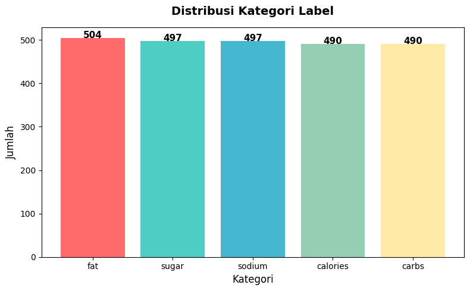
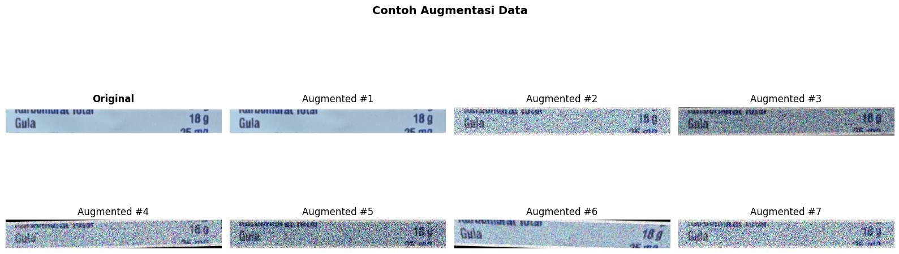
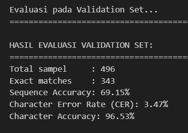
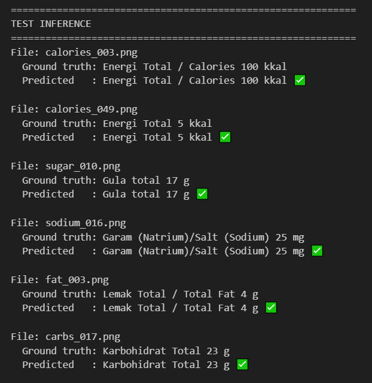
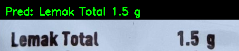
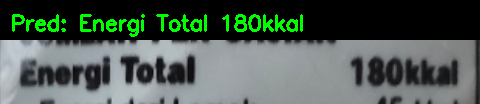

# CRNN OCR: Indonesian Nutrition Label

[](https://www.tensorflow.org/)
[](https://www.python.org/)
[](https://keras.io/)
[](https://opensource.org/licenses/MIT)

Proyek ini menghadirkan solusi **End-to-End OCR** menggunakan arsitektur **CRNN (Convolutional Recurrent Neural Network)** untuk membaca teks pada label informasi nilai gizi (nutrition labels) produk makanan di Indonesia. Fokus utama adalah menangani variasi kualitas gambar dan kompleksitas teks pada kemasan retail.

---

## Project Highlights

- **Custom Architecture**: Integrasi MobileNetV2 dengan Bidirectional LSTM dan algoritma CTC.
- **Real-world Robustness**: Dilatih untuk menangani gangguan visual seperti _blur_, _glare_ (pantulan cahaya), dan _overlapping text_.
- **Production Ready**: Dilengkapi dengan script inference mandiri dan export model dalam format `.keras` dan `SavedModel`.
- **Balanced Data**: Dataset yang dikurasi secara manual dengan distribusi kelas yang sangat seimbang.

---

## Technical Architecture

Model ini mengadopsi struktur hybrid yang efisien untuk pengenalan urutan karakter:

1.  **Backbone (CNN)**:
    - Menggunakan **MobileNetV2** (Pre-trained pada ImageNet).
    - Ekstraksi fitur dihentikan pada **`block_3_expand_relu`**. Pemilihan layer ini krusial untuk mempertahankan resolusi fitur horizontal (480px input -> 120 timesteps), memungkinkan model "melihat" karakter yang sangat kecil sekalipun.
2.  **Dimension Bridge**:
    - Penambahan layer **Conv2D** kustom untuk mereduksi tinggi gambar menjadi 1 pixel tanpa mengurangi resolusi lebar. Hal ini mengubah data spasial menjadi representasi urutan (_sequence_).
3.  **Sequence Modeling (RNN)**:
    - **2x Bidirectional LSTM** (128 units). Lapisan ini menangkap dependensi karakter secara dua arah (maju dan mundur), sangat efektif untuk konteks kata-kata nutrisi seperti "Karbohidrat" atau "Kalori".
4.  **Prediction (CTC)**:
    - Menggunakan **CTC Loss** yang memungkinkan pelatihan tanpa anotasi posisi tiap karakter. Hasil akhir didekode menggunakan _Greedy Search_ untuk konversi probabilitas menjadi teks string.

---

## Exploratory Data Analysis (EDA)

### Dataset Composition

Dataset terdiri dari **420 citra label** yang dikategorikan ke dalam 5 grup nutrisi utama.

| Kategori         | Jumlah | Deskripsi                    |
| :--------------- | :----- | :--------------------------- |
| **Calories**     | 490    | Label energi total (Kkal/Kj) |
| **Carbohydrate** | 490    | Informasi serat dan gula     |
| **Fat**          | 504    | Lemak total dan lemak jenuh  |
| **Sodium**       | 497    | Kandungan garam (mg)         |
| **Sugar**        | 497    | Kandungan gula (g)           |



### Data Augmentation Strategy

Kami menggunakan library **Albumentations** untuk mensimulasikan tantangan kamera smartphone:

- **Gaussian Noise & Blur**: Meniru sensor kamera murah atau getaran tangan.
- **Brightness/Contrast**: Menangani kondisi pencahayaan minim atau berlebih (_glare_).



---

## Training Performance

- **Learning Rate**: 0.0002 (Adam Optimizer).
- **Epochs**: 200 (dengan Early Stopping).
- **Input Resolution**: 64 x 480 (RGB).

Pelatihan menunjukkan konvergensi yang stabil dengan penurunan CTC Loss yang signifikan pada data validasi, menandakan model tidak mengalami _overfitting_ meski menggunakan arsitektur yang cukup kompleks.


---

## Inference Results

Model diuji pada data yang belum pernah dilihat sebelumnya (_unseen data_) untuk memvalidasi generalisasi.

### Original Test Set

Visualisasi hasil prediksi model pada dataset testing yang menunjukkan akurasi tinggi pada teks rapat.


### Test Data

Pengujian model menggunakan dataset pada folder `test`:


### Pengujian pada Data Baru

Pengujian data baru menggunakan script `inference.py` pada folder `test-data-baru`. Hasil prediksi visual disimpan secara otomatis di folder `hasil_data_baru`.




---

## Project Structure & Setup

```text
.
├── foto/                   # Visualisasi EDA dan training
├── saved_model/            # Model weights & vocab mapping (JSON)
├── test/                   # Dataset uji original
├── test-data-baru/         # Folder untuk testing gambar baru Anda
├── hasil_data_baru/        # Output visual hasil prediksi
├── valid/                  # Dataset validasi
├── CRNN_OCR_Final.ipynb    # Pipeline pelatihan lengkap
├── inference.py            # Script prediksi (Run this!)
└── README.md               # Dokumentasi utama
```

### 1. Petunjuk Setup Environment

Ikuti langkah-langkah di bawah ini untuk menyiapkan lingkungan kerja Anda:

1. **Clone Repository**:

   ```bash
   git clone https://github.com/FarelZIKRI/Diabites-OCR-CRNN.git
   cd Diabites-OCR-CRNN
   ```

2. **Buat Virtual Environment** (Opsional tetapi sangat disarankan):
   - Pada Windows:
     ```powershell
     python -m venv venv
     .\venv\Scripts\activate
     ```
   - Pada macOS/Linux:
     ```bash
     python3 -m venv venv
     source venv/bin/activate
     ```

3. **Install Dependensi**:
   Instal semua library yang dibutuhkan dari file `requirements.txt`:
   ```bash
   pip install --upgrade pip
   pip install -r requirements.txt
   ```

---

### 2. Tautan & Cara Memuat Model Machine Learning

- **Tautan Unduhan Model**:
  Model pre-trained sudah disertakan langsung di dalam repository ini pada folder `saved_model/crnn_model.keras`. Anda juga dapat mengunduhnya secara manual melalui tautan berikut:
  **[Download Model crnn_model.keras](https://github.com/FarelZIKRI/Diabites-OCR-CRNN/raw/main/saved_model/crnn_model.keras)**

- **Cara Memuat (Load) Model di Kode**:
  Untuk memuat model dalam Python menggunakan TensorFlow Keras, gunakan cuplikan kode berikut:

  ```python
  import tensorflow as tf

  # Path lokasi model disimpan
  MODEL_PATH = "saved_model/crnn_model.keras"

  # Memuat model tanpa mengompilasi ulang (karena hanya digunakan untuk prediksi/inference)
  model = tf.keras.models.load_model(MODEL_PATH, compile=False)
  print("Model berhasil dimuat!")
  ```

---

### 3. Cara Menjalankan Aplikasi

Untuk melakukan pengujian atau inferensi data baru menggunakan model OCR CRNN:

1. Letakkan gambar kemasan nilai gizi baru yang ingin diprediksi (berformat `.png`, `.jpg`, atau `.jpeg`) ke dalam folder `test-data-baru/`.
2. Jalankan skrip inferensi `inference.py`:
   ```bash
   python inference.py
   ```
3. Hasil prediksi berupa gambar visualisasi teks yang terdeteksi akan otomatis disimpan di dalam folder `hasil_data_baru/` dengan awalan nama `res_*.png`.

---

## Author

**Muhammad Farel Zikri** - _AI Engineer Enthusiast_
